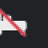

# Sleepless

A KDE Plasma 6 panel widget that blocks sleep, screen dimming, screen blanking
and screen locking, and checks in every few hours to ask whether you still want
it on.

Built for using a laptop as a music stand — chord sheets stay on screen through
a long practice session — but it is useful for anything where the screen must
stay up without input: reading, following a recipe, watching a stream, a long
build.

 → click → 

A bed means the machine is free to sleep; a red slash across it means sleep is
blocked. The bed is drawn with `isMask`, so it takes the theme's text colour and
stays correct in light and dark schemes, and the slash uses the theme's negative
colour. The slash leans the same way as Breeze's own disabled-state icons
(muted volume, disconnected network).

Breeze's built-in `system-suspend-uninhibited` / `system-suspend-inhibited` pair
was tried first and rejected: both states are the same padlock glyph differing
only by a thin diagonal, which is unreadable at panel size.

## What it blocks

| Behaviour | Blocked |
|---|---|
| Automatic suspend | yes |
| Display dimming | yes |
| Display turning off | yes |
| Screen locking | yes |
| Closing the lid | **no** — the lid still suspends |

## How it works, and what it does *not* do

Sleepless works by **inhibition**, not configuration. A small holder process
holds the standard locks for exactly as long as it runs:

```
systemd-inhibit --what=idle:sleep     # logind's own idle and sleep handling
  kde-inhibit --power --screenSaver   # PowerDevil: dimming, blanking,
                                      # locking and suspend
```

It **never reads or writes** `powerdevilrc`, `kscreenlockerrc` or any other
setting. There is nothing to save and nothing to restore. When the lock is
released, PowerDevil simply resumes obeying whatever your settings are at that
moment — including any changes you made while Sleepless was on. If the holder
is killed, or the machine loses power, normal power management just resumes.

## The check-in

After the configured interval (3 hours by default) a notification appears:

> **Sleepless is still on**
> Your screen has been kept awake for 3h. Keep going?
> [ Still playing ] [ I'm done ]

- **Still playing** — another full interval.
- **I'm done** — switches off; normal power management resumes.
- **Anything else** (closing it, or no answer) — stays on and asks again after
  another interval. Only an explicit "I'm done" switches it off.

The notification is sent at critical urgency, so Plasma keeps it on screen
until you act on it.

## Install

```sh
git clone https://github.com/ConorMarco/plasma-sleepless.git
cd plasma-sleepless
./install.sh
```

This installs the `sleepless` helper to `~/.local/bin`, installs the plasmoid,
and adds the widget to the right-hand end of your bottom panel. It is safe to
re-run. To remove everything:

```sh
./uninstall.sh
```

Upgrading an existing install needs a `systemctl --user restart plasma-plasmashell`
afterwards, because plasmashell caches widget QML. `install.sh` reminds you.

## Command line

The helper works on its own, so you can bind it to a shortcut or call it from a
script:

```sh
sleepless start [minutes]   # block sleep; check in after [minutes] (default 180)
sleepless stop              # release everything
sleepless toggle [minutes]  # start if off, stop if on
sleepless status            # "on <seconds-until-check-in>" or "off"
```

The widget polls `status`, so toggling from a terminal updates the icon too.

## Requirements

- KDE Plasma 6
- `kde-cli-tools` (`kde-inhibit`)
- `libnotify` (`notify-send` 0.8+, for the check-in buttons)
- `systemd` (`systemd-inhibit`)

## Note for Plasma 6.7

A plasmoid that defines only a `compactRepresentation` and no
`fullRepresentation` silently fails to render — the applet loads, takes no
space and logs no error. Sleepless therefore ships a `fullRepresentation` even
though `preferredRepresentation` means a panel never shows it.

## Licence

GPL-2.0-or-later. See [LICENSE](LICENSE).
